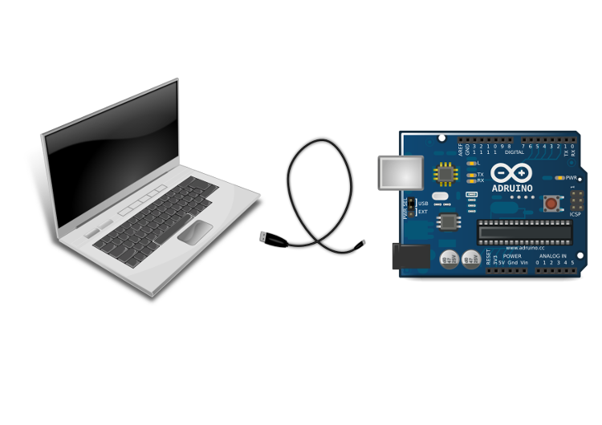

{mainmatter}

Fortune Cookie server
=====================

Introduction
------------

This is the first experiment in Life after Blink: it does not need any extra hardware.

### What will you learn, and how will it help you?

In this experiment you will write an Arduino sketch that responds to
serial input and uses serial output.

You'll find serial input and output are useful for debugging, and for
controlling the Arduino from your laptop or desktop computer.

### Background

Back in the 1980s, most Unix distributions included a program called
*fortune*, and it's still available in most Linux distributions.

When you run `fortune` it displays a 'cookie' - a short, pithy message containing
words of wisdom, the sort of thing you'd expect to find in a Chinese
fortune cookie.

### The fortune program

What you'll be doing is to write a short sketch on the Arduino which
displays a different piece of text each time you press enter on your
computer.

### The Arduino Serial interface

To do that you'll use the Arduino's *Serial* interface.

 The Arduino Serial interface allows you
to link your computer to the Arduino using a USB cable and then send
text messages between your computer and the Arduino. In the next section
we'll see how to do this using a sketch on the Arduino and the Serial
Monitor in the Arduino IDE on your computer.

## Typical workflow

You'll follow a typical sequence of steps while developing this sketch.

1. If possible, find an existing sketch to adapt
2. Make any necessary changes
3. Compile your sketch
4. Fix any syntax errors
5. Upload your sketch to the Arduino
6. Watch it run.
6. Go back to step 2 if necessary

Don't start from scratch
------------------------

When creating a sketch for the Arduino it's often easiest to start with
something similar that already exists and modify it to do what you want.

For this experiment we'll start with an example sketch called SerialEvent
which accepts characters send via the Serial Terminal and then echoes
them back when you send a return character.

In your fortune program you don't want to echo back user input, but you do want to respond to an input newline by
sending the text of the next cookie to the user. That's similar enough that SerialEvent is probable a useful starting
point for your Fortune sketch.

N> This example works on the Arduino Uno, the Mega2560 and
the Shrimp but it does not currently work on the Arduino Leonardo or
Arduino Pro Mini.

## The starting point

Take a look at the SerialEvent sketch.

Start the IDE if necessary, and then select `File/Examples/04. Communications/Serial Event` from the menu.

You should see the code that's listed below displayed in the IDE.

### SerialEvent

    String inputString = "";         // a string to hold incoming data
    boolean stringComplete = false;  // whether the string is complete

    void setup() {
      // initialize serial:
      Serial.begin(9600);
      // reserve 200 bytes for the inputString:
      inputString.reserve(200);
    }

    void loop() {
      // print the string when a newline arrives:
      if (stringComplete) {
        Serial.println(inputString); 
        // clear the string:
        inputString = "";
        stringComplete = false;
      }
    }

    /*
      SerialEvent occurs whenever a new data comes in the
     hardware serial RX.  This routine is run between each
     time loop() runs, so using delay inside loop can delay
     response.  Multiple bytes of data may be available.
     */
    void serialEvent() {
      while (Serial.available()) {
        // get the new byte:
        char inChar = (char)Serial.read(); 
        // add it to the inputString:
        inputString += inChar;
        // if the incoming character is a newline, set a flag
        // so the main loop can do something about it:
        if (inChar == '\n') {
          stringComplete = true;
        } 
      }
    }

### Understanding SerialEvent

The code starts by declaring a couple of variables.

    String inputString = "";  
    boolean stringComplete = false;

In the *setup* function it initialises the Serial interface to run at a
speed of 9600 baud and allocates enough room for a long (200 character)
input string.

    void setup() {
      // initialize serial:
      Serial.begin(9600);
      // reserve 200 bytes for the inputString:
      inputString.reserve(200);
    }

In the *loop* function it checks to see if the input string is complete.
(The relevant variable gets set in the *serialEvent* function, which
we'll look at later).

If the input is complete, it is sent back to the computer via the Serial
interface, and the input variable is set up ready to receive the next
lot of data.

    void loop() {
      // print the string when a newline arrives:
      if (stringComplete) {
        Serial.println(inputString); 
        // clear the string:
        inputString = "";
        stringComplete = false;
      }
    }

The *serialEvent* function is the most complex part of the sketch.

If you define a function called serialEvent, it is run after each execution of the loop function.

    void serialEvent() {
      while (Serial.available()) {
        // get the new byte:
        char inChar = (char)Serial.read(); 
        // add it to the inputString:
        inputString += inChar;
        // if the incoming character is a newline, set a flag
        // so the main loop can do something about it:
        if (inChar == '\n') {
          stringComplete = true;
        } 
      }

It reads every available character in the Arduino's serial buffer and
adds them to the input string.

If the character is a newline, it sets the *stringComplete* variable to
show that input is complete.

The next time that *loop* is executed, it will see the *stringComplete*
variable is set to true and will act accordingly.

Creating the fortune sketch
---------------------------

You can use this sketch as the basis of your cookie server, with a
couple of changes.

Your requirements are different in two ways:

1.  You don't care much what the user types on the computer. You just
    want to respond by sending the next 'fortune cookie' message when
    the user types a newline.
2.  The message you send should be different each time. (up to a limit,
    of course - you only have limited memory in which to store the
    messages).

In a minute we'll take a look at how to change the SerialEvent script,
but first, let's open the current version and save it to a new location.
You don't want to overwrite the supplied example!

### Saving a private copy of the SerialEvent sketch with a new name

Here's what to do:

1.  If necessary, start up the Arduino IDE on your computer.
2.  From the file menu, go to *examples/04. communication/SerialEvent*.
3.  You should see the SerialEvent script open.
4.  From the file menu, select *save as*.
5.  A file dialog will open. Change the name of the file you're about to
    save to *fortune*, and save it in the *sketchbook* folder of your
    home directory.

Now you're ready to modify your script to serve random messages.

### An array of messages

You want to send a number different messages, so you need to create an
array to hold them.

The Arduino scripting language is based on C. Because of the way that C
controls the memory that programs use, the simplest approach that you
can take means you have to decide in advance the maximum number of
different messages to send.

To keep things simple, we'll stick to four different messages, and they
will be just single words. We'll make the messages more interesting a
little later.

Here's the code you need to set that limit and define what the messages
should be:

    const int MAX = 4;
    char *greetings[MAX] = {"These", "are", "some", "strings"};

Next, you'll need a variable to keep track of which message you have
sent, so you don't keep sending the same message, and a variable to tell
you when to send a message.

The variable that keeps track of which message to send starts at 0
because C programs start counting **at 0**! The first element of an
array in C is element 0, not element 1.

    int index = 0;
    boolean reply = false;

In the *setup* code, you need to open the serial connection, specifying a baud rate (transmission speed) of
9600 bits/second.

    void setup() {
      // initialize serial:
      Serial.begin(9600);
    }

The loop function should check to see if a reply is required. If it is,
the function should send the next message and increment the message
pointer.

If you have returned the last message, the loop function should reset
the pointer to zero, ready to go through the messages again.

Here's the code:

    void loop() {
      // print the string when a newline arrives:
      if (reply) {
        Serial.println(greetings[index++]);
        reply = false;
        if (index == MAX) {
          index = 0;
        }
      }
    }

Finally, you need to write code to respond when a new character is sent
from the computer to the Arduino.

    void serialEvent() {
      while (Serial.available()) {
        // get the new byte:
        char c = (char) Serial.read();
        if (c == '\n') {
          reply = true; 
        }  
      }
    }

<!-- TODO: update code location below -->

That's all you need! You will find the complete code for the sketch
[here](http://www.rareschool.com/orphans/code/fortune.ino)

Testing the sketch
------------------

If you type or copy the code into your new sketch and send it to the
Arduino you should be able to run a test.

Once the code has uploaded, open the Serial Monitor in the Arduino IDE.

You can open it by clicking on the icon on the right of the IDE toolbar.

A new window should open with a text field and button marked send at the
top and a text pane below.

Beneath the text pane you will see a checkbox titled autoscroll and two
drop-down menus.

If one of the drop-downs is displaying *no line ending* change the
selection to *Newline*.

Type some text (it does not matter what) and press the *send* button.

A message should appear int the text pane.

Each time you press send a new message should be displayed; after the
forth message the first one should appear again.

Congratulations
---------------

Well done! You've now got a working fortune cookie server, and (more
important) you know how to use the Arduino serial interface.

If you have time, you can improve the cookie server.

A better fortune cookie server
------------------------------

If you finished Experiment 1 you will know that the fortune cookie
server described is pretty basic.

The messages it sends aren't real fortune cookie sayings, and it always
repeats the same messages in the same order.

In this *challenge experiment* we'll look at how to fix both problems.

Of course it's easy to make the messages more like the traditional
output from real fortune programs. You just need to replace the array of
messages with better text, and perhaps increase the number of messages.

Here's an example:

    const int MAX = 6;
    char *greetings[MAX] = {
    "A stitch in time saves nine",
    "Too many cooks spoil the broth",
    "Fools seldom differ",
    "Great minds think alike",
    "Many a mickle makes a muckle",
    "All that glitters is not Gold"};

This will give you six messages, each of which is a traditional proverb.

Make the change, upload the revised sketch and run it as before. You'll
see the six messages appear in order and then they will cycle round
again.

That's better, but it's still not *random*.

Making things random
--------------------

Most fortune cookie servers return *random* fortune cookies.

There is a function called random in the Arduino libraries. According to
the documentation, *random(num)* will produce a whole number between 0
ad *num*.

So random(MAX-1) will produce a number between 0 and MAX-1; that's just
what we need to select a message from our array of messages.

We need to make a couple of changes to our script to use the *random*
function.

Our new version of *loop* should look like this:

    void loop() {
      // print the string when a newline arrives:
      if (reply) {
        int index = (int) random(MAX-1);
        Serial.println(greetings[index]);
        reply = false;
      }
    }

This calls the \_random() \_function, which in theory can return a large
whole number, called a long. We need to convert the value to an ordinary
integer, hence the (int).

If you upload this sketch to the Arduino and run it you should see the
the proverbs printed one at a time in the Serial Terminal window each
time you press *Send*.

They should appear in an apparently random order, and you may find that
some sayings are repeated, while others may not appear for quite a
while.

It looks as if random() has cracked it. *Not so*.

If you start the program again by pressing the reset button you'll find
that the sequence of messages is the same every time.

It's not random - it's what is known a s a pseudo-random sequence.

A definition of random
----------------------

What do we mean when we say things are *random*?

You probably have an intuitive feeling for what makes a series of events
random, but it is very difficult to define.

Mathematician [Gregory J. Chaitin
suggests](https://www.cs.auckland.ac.nz/~chaitin/sciamer.html) that
information embodied in a random series of numbers cannot be
\`\`compressed,'' or reduced to a more compact form.

One consequence of this is that numbers produced by a computer program
without some random input cannot be random, so what we need is a source
of truly random data to kick the whole process off.

One of the Arduino's capabilities is to measure the voltage on some of
its input pins, using a function called analogueRead().

If you run analogueRead() to read the voltage of a pin which is not
connected to anything, the voltage that the Arduino measures will be
random. That can be used as a *seed* for the random number function,
which will produce a different sequence if given a different seed.

You'll need to make one small change to your script, inserting a line in
the *setup* function.

If you upload the revised script and run it you should see a different
sequence every time.

The revised sketch
------------------

Here's the whole sketch:

    // based on SerialEvent
    // created by Romilly Cocking
    // http://www.rareschool.com
    // and placed in the public domain

    const int MAX = 6;
    char *greetings[MAX] = {
    "A stich in time saves nine",
    "Too many cooks spoil the broth",
    "Fools seldom differ",
    "Great minds think alike",
    "Many a mickle makes a muckle",
    "All that glitters is not Gold"};
    boolean reply = false;

    void setup() {
      // initialize serial:
      Serial.begin(9600);
      // use unconnected analogue input 0 to generate
      // a random seed
       randomSeed(analogRead(0));
    }

    void loop() {
      // print the string when a newline arrives:
      if (reply) {
        int index = (int) random(MAX-1);
        Serial.println(greetings[index]);
        reply = false;
      }
    }

    void serialEvent() {
      while (Serial.available()) {
        // get the new byte:
        char c = (char) Serial.read();
        if (c == '\n') {
          reply = true; 
        }  
      }
    }

Conclusion
----------

You've now created a program whose output is unpredictable.

You could use that idea in a robot, making random moves as it exploring
an unknown environment, or in an mp3 player shuffling tracks.

Sometimes randomness can be useful.
