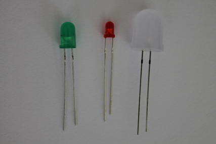

Morse Code Flasher
==================

Introduction
------------

In this experiment you will add a little code to an almost-complete
script which will flash out morse code using an LED.

### What you will learn

You'll learn

-   how to set digital outputs on the Arduino
-   how to wire an LED up to the Arduino board or Shrimp

### How this will help you

In many projects you will want to use one or more LEDs as a way of
letting the Arduino signal information to the outside world.

Even if you are building a project that does not require LEDs you may
want to signal what is going on for debugging purposes.

If you're building an Arduino project that controls LEDs, buzzers or
relays, you will need to use the Arduino's *digital output* capability.

Digital outputs are easy to understand: they are either *on* or *off*.
In the case of the Arduino, an *on* output will be at 5 volts, and an *off*
output will be at 0 volts.

### Morse code

When I was a young boy host the short wave radio band was alive with the
beeping of Morse code signals. In those days Radio Amateurs (Hams) had
to learn morse code, and morse was widely used by the Merchant Marine,
the Armed Forces - and spies!

These days it's still used by some radio hams. You'll find a detailed
description of Morse code in the relevant [Wikipedia
article](http://en.wikipedia.org/wiki/Morse_code), but here is a brief
summary.

#### Morse code summary

Morse code can be used to transmit upper case letters, numbers and some
punctuation symbols.

Each character is represented as a sequence of dots and dashes.

A *dot* is a short signal, one unit of time long; a *dash* is three
times longer.

Dots and dashes are separated by breaks of the same length as a dot.

The end of each character is marked by a break of three time units.

Words are separated by a break of seven time units.

Physical Computing
------------------

In this experiment you will finish off a sketch that receives text via
the Serial Terminal (as in experiment 1), but this time you will
translate the text into Morse code and send the Morse code by flashing
an LED.

### The incomplete sketch

Much of the code has been written. The sketch you'll start with combines
some of the code in the Arduino SerialEvent sketch
with some code that can translate ASCII text into a series of dots and
dashes.

The code provided sets a constant *DIT*, which is the length of a single
unit of time in milliseconds.

The code provided uses two functions which you will have to write: *void
on(int length)* should turn the LED on for *length* units of time and
*void off(int length)* should turn it off for *length* units of time.

#### SerialEvent

The sketch uses code from the SerialEvent sketch that you looked at in
Experiment 1.

### LED technology

LEDs (Light Emitting Diodes) are active devices that glow when a voltage
of the appropriate polarity is applied to them.

They come in various shapes and sizes: the next picture shows three
'through-hole' LEDs (as opposed to th surface-mount LEDs on the Arduino
boards.

#### Through-hole LEDs

The diagram shows a 3mm red LED, a 5mm green LED, and a 10mm cloudy
white LED.

Notice that each LED has a short and a long LED. If you apply a positive
voltage to the short leg nothing will happen; if you apply an
appropriate positive voltage to the long LED, the LED *may* light up.

Notice the word *may*. If the voltage you apply is too low, the LED will
light dimly or not all. If it is too high, the LED will overheat, burn
out, and *possibly explode*!

#### LED circuitry

For this reason most circuits attach a load resistor to an LED. The
current flowing through the LED causes a voltage drop across the
resistor; if the value of the resistor is matched to the LED and the
voltage, the current that flows will be enough to light the LED without
damaging it.

If you ever need to work out what value of load resistor to use with an
LED, Sparkfun have a great [explanatory
article.](https://www.sparkfun.com/tutorials/219)

#### 5 volt LEDs

If you're using the kit of parts decribed earlier, <!-- insert link -->
 or bought your own using the details in appendix A, you don't need to worry about load resistors.
 
 The LEDs in the kit are special. They are know a s5 volt LEDS. As the name suggests, you can safely apply 5 volts to,
 them, because they come with a built-in load resistor.
 
 You can read more about why I love 5v LEDs
 [in my blog](http://blog.rareschool.com/2014/06/3-simple-steps-to-test-your-new-arduino.html)

#### Driving LEDs from Arduino and Shrimp

It's easy to drive an LED from an Arduino or Shrimp.

If you're using an off-the-shelf Arduino, you'll find that one of the
Arduino output pins has an LED and resistor built in to the Arduino
board, and connected to pin 13.

The blink sketch is one of the first programs that most Arduino users
run, and you probably tried it before starting this course. If you need
to remind yourself of the details, [this Arduino
article](http://arduino.cc/en/tutorial/blink) is a good place to go.

If you're using a Shrimp, it also has a LED which is connected to pin
13.

Writing your sketch
-------------------

Most of the code you'll need has already been written; you can download
it [here](http://www.rareschool.com/orphans/code/morse.ino).

You need to add three bits of code, and the Arduno blink sketch should
be a good inspiration.

Each place where you need to add code is marked by a comment.

The first code to add should declare a variable called led, which will
specify which digital pin to use.

Next, you'll need to add some code to the *on* function.

Finally, you'll need to add some code to the *off* function.

If you want some help, you'll find a [competed version
online](http://www.rareschool.com/orphans/code/morse_complete.ino).

### Testing your sketch

To test your sketch, upload it to the Arduino or Shrimp, and then open
the serial terminal. Make sure the bard rate is set to 9600 and that
you've chosen the newline terminator.

Type: *SOS SOS TITANIC*in the Serial Terminal, click send, and
you should see two things happen:

The morse code should appear in the terminal window, and the LED should
flash out the distress call.

(**Note**: no ships were sunk in the making of this exercise).

Challenge exercises
-------------------

Here are a couple of challenge exercises which you can try if you want
to explore things further.

### Using a different output pin

Change your code to use another output pin.

If you're using a Shrimp, it's very easy (I hope!)

If you're using an Arduino, and you connect your 5 Volt LED to pin 12
(say) and +5 Volts, you will need to read the earlier comment about
switching *low* and *high* outputs and change your code accordingly.

However, there is more work involved in changing the hardware
configuration.

You'll need to pick an output pin that is close to a +5 volt or grounded
pin, so that you can easily use the 5 V LED.

Pin 12 is probably a good bet, as it's close to a 5 volt socket. For the
Shrimp, you'll need to know which Arduino pins correspond to which pins
on the chip.

#### Pin mapping

This diagram applies to the ATMega168, which has the same layout as the
328p chip used for the Shrimp.

### Handling lower case letters

At the moment, the code will not translate lower case letters.

There are at least two ways you could fix this.

1.  You could change the data in the codes variable, but that would be
    fiddly and hard to check.
2.  You could use an appropriate function from the Arduino library. See
    if you can track it down and make the change.

Getting help
------------

As usual, the best place to get help or discuss problems is the google
 group.

## Conclusion

While Morse code is not as widely used as it was, you can still use the on-board LED to signal information.

Some Arduino sketches start by flashing the on-board LED to indicate that they are ready for use, and some
send different numbers of flashes as status signals. In a wireless-based Arduino application, four flashes might mean
'no signal detected'