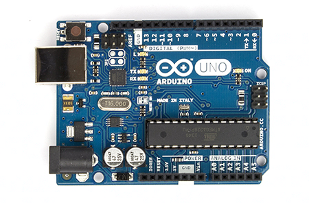

LED Ripple
==========

Introduction
------------

### What you will learn

In this experiment you will learn more about the types and locations of
pins available on the Arduino and Shrimp, and how they are identified in
programs and data sheets.

### How this will help you

You'll need to know the functions and names of the Arduino pins in order
to follow published projects and design your own.

### Arduino/Shrimp/ATMega pinouts

The chips at the heart of the Arduino are part of Atmel's ATMega family
of microcomputers.

The Arduino Uno, the Shrimp and the older Arduino duemilanove all use a
version of the chip called the ATMega328p.

The Arduino Mega2560 uses a larger and more powerful chip called the
ATmega2560.

.

#### the Shrimp

The Shrimp uses a 28-pin Dual-in-line (DIP) ATMega328p.

The DIP chip format refers to the fact that the chap has two rows of
pins (hence dual in-line) which are spaced 0.1" apart along the chip and
0.3" across the cip.

This allows you to insert a DIP chip into a breadboard or solder it into
stripboard, which is perfect for us experimenters!

If you look carefully you will see a small semi-circular depression near
the top of the chip. This tells you which way up the chip is.

That's rather important to know, as **you can damage the chip's
electronics** if you insert it upside down and apply power.

#### Arduino Duemilanove

Like the Shrimp, the Duemilanove uses a 28-pin Dual-in-line (DIP)
ATMega328p.

#### Arduino Uno (DIP)

The Arduino Uno R3 looks similar; like the Shrimp and the Duemilanove it
uses a DIL ATmega328p.

#### Arduino Uno (SMD)

The Arduino Uno SMD edition uses an ATMega328p in a different package.
This Surface mount device (or SMD) is smaller and cheaper than the DIP
version, but it's much harder to solder and you can't easily use the
chip with a breadboard or stripboard.

#### Arduino Mega2560

The Arduino Mega2560 has a more powerful ATMega2560 chip, which has more
memory and more pins.

The Mega2560 uses an SMD.

#### ATMega328p

Most of the Arduino clones use the ATMega328p DIL chip. This diagram
mentions the ATMega168, but this has the same pins performing the same
functions as the pins on the 328p so it's fine for our purposes.

Just to keep you on your toes, **each pin has four different
descriptions** :)

If you take a look at the pin on the left of the diagram, it has the
following information displayed:

reset, PCINT0/Reset, PC6, 1

The *first column* tells us the name for that pin in Arduino
documentation. You'll see the text silkscreened (printed) on the Arduino
board. The first pin is labelled reset.

The *second column* tells you what that pin can do. You'll need to
consult the Arduino ATMega328p datatsheet to find out what this means;
you don't need that information for the experiments we are doing.

The full datasheet is freely available from Atmel (the maker of the chip),
but it's a big download and a long read! At the time of pubishing, you can find it
[here](http://www.atmel.com/images/doc8161.pdf).

Some pins have more than one entry in the capability column because they
can be configured to do more than one thing. The first pin can be used
to reset the chip or to generate in interrupt, depending on how the chip
is configured.

The *third column* is mostly of interest if you are trying to control
the chip using assembly code, which most experimenters never have to do.
It tells us that the first pin is associated with bit 6 of an internal
register called PC

The *fourth column* contains physical pin numbers. Physical pin numbers
are **used for all DIL chips**. The numbers start at 1 at the top left
of the chip and go up by one as you go counter-clockwise around the chip
until you get to top right. For the 28-pin DIL chip, that means that the
top right pin is number 28.

Ripple your LEDs
----------------

In the main part of experiment 3 you will get an array of 8 LEDs to
display a tasteful ripple pattern.

You can see a rather fuzzy YouTube video
[here](http://youtu.be/NfXy-o1qwlw).

The simplest way of doing this is to create an array of pin numbers in
your new sketch.

Then. in *setup*, you can loop through the array setting each one to be
an output pin.

Finally, in *loop*, you can loop through each pin turning it on for 100
milliseconds and then off again.

You should be able to find out all you need to know about arrays and
looping on the Arduino website, but if you get stuck, there's a complete
solution shown later.

If you're using the recommended hardware for this course, you won't need
to attach resistors to your LEDs because the green LEDs have resistors
built-in. They are designed to light up when 5 volts are applied across
them, which means they will work with the Atmel ATMEGA326p, the chip at
the heart of the Arduino and the Shrimp.

If you're interested in finding out more about the benefits of using 5
volt LEDs for testing, you might enjoy [this
article](http://romillys-robots.blogspot.co.uk/2014/06/3-simple-steps-to-test-your-new-arduino.html).

### Which pins should you use?

That's up to you! The video (and my code) is based on using digital pins
3 to 9. Here's which I chose them:

1.  They are close together on the Arduino board so they are easy to
    wire up to the breadboard.
2.  Each one is a digital pin. In other words, as outputs these pins are
    on or off and as inputs they can only detect high or low voltages.
    You can use analogue pins as digital pins. Analogue pins can also be
    used to measure voltages, but you don't need to do that in this
    experiment.
3.  **Don't** use digital pins 0 or 1; these are used to link the
    Arduino or Shrimp to your computer.
4.  **If you use digital pin 13**, remember that on the Arduino that has
    an on-board LED attached. That's not a problem but it will flash as
    well as any external LED you may connect.

If you're using a Shrimp you can use the same set of pins but the wiring
won't be as tidy. You will have to use the pinout diagram you saw
earlier to work out which physical pin on the chip corresponds to which
digital pin in your program.

### Sample code

Here's my solution:

    int led_pins[8] = {2, 3, 4, 5, 6, 7, 8, 9};

    // the setup routine runs once when you press reset:
    void setup() {                
      // initialize the digital pin as an output.
      for (int i = 0; i < 8; i++) {
        pinMode(led_pins[i], OUTPUT);
      }      
    }

    // the loop routine runs over and over again forever:
    void loop() {
      for (int i = 0; i < 8; i++) {
        digitalWrite(led_pins[i], HIGH);
        delay(100);
        digitalWrite(led_pins[i], LOW);  
      }
    }

Counting, counting
------------------

If you've finished the ripple counter and want some more fun, why not
convert your code to count up from 0 to 255 repeatedly and display each
number in binary?

### Creating a binary counter

If you've finished the ripple counter and want some more fun, why not
convert your code to count up from 0 to 255 repeatedly and display each
number in binary?

There are plenty of online examples of code that do this sort of thing,
but it's not always easy to understand how the code works.

Here are three different approaches.

1.  *Brute force arithmetic* uses remainders and repeated division. It
    is based on the way you may have been taught to convert decimal
    numbers to binary at school.
2.  *and and shift* uses bitwise operations to speed things up a bit.
3.  *bitRead* uses a library function which does just what we need!

Let's start by reviewing what we are trying to do.

We have a number in the range 0-255 and we want to turn eight LEDs on or
off depending on the number's binary representation.

The following skeleton code will form the common part of the three
solutions:

    #define BIT_COUNT 8

    int led_pins[BIT_COUNT] = {2, 3, 4, 5, 6, 7, 8, 9};

    void setup() {                
      for (int i = 0; i  BIT_COUNT; i++) {
        pinMode(led_pins[i], OUTPUT);
      }      
    }

    void loop() {
      for (byte value = 0; value  256; value++) {
        display(value);
        delay(100); 
      }
    }

Each solution will implement *display* in its own way.

#### 1. Brute Force Arithmetic

For your first approach, you can use your knowledge of number
representations to guide the code you write.

Let's take a concrete example. Suppose our number is 175.

A little work with a paper and pencil or a calculator should convince
you that this number is 128 + 32 + 8 + 4 +2 + 1.

This means that 175 is 10101111 in binary notation.

If you met binary arithmetic at school you may have been taught to
convert decimal numbers to binary by repeated division and remainder.

You can use that approach in your sketch.

Let's look at our example. 175 = 10101111 and we can find the least
significant (rightmost) binary digit by looking at the remainder when we
divide the number by two.

10101111 % 2 gives us 1, the rightmost binary digit. The Arduino sketch
will treat this as a *true* value, which means we can use it to turn the
rightmost LED on.

Next we halve the number.

10101111 / 2 is 01010111. Once again, we can calculate the remainder
modulo 2 and determine if the next digit is 0 or 1.

If we repeat this process six more times we will reach the rightmost
digit, which in this case is a 1. The combination of division and
remainder will convert the original number into a sequence of 1 (true)
and 0 (false) values.

Here's the code for *display*:

    void display(unsigned int value) {
      for (int i = 0; i < BIT_COUNT; i++) {
           digitalWrite(led_pins[i], value % 2);
           value = value / 2;
        }
    }

#### 2. Bitwise and and shift

For our second approach, we'll use bitwise operations.

The Arduino sketching language is a form of C/C++, and so it supports
C's bitwise operations. You can read about these [in the Arduino
Playground](http://playground.arduino.cc/Code/BitMath).

The operations we will need to use are bitwise *and*, and *right shift*.

Let's look at our example again. 175 = 10101111 and we can find the
least significant (rightmost) binary digit by using bitwise *and*:

10101111 & 00000001 gives us 00000001, or 1, the rightmost binary digit.
The Arduino will treat this as a *true* value.

Next we do a *right shift* operation on the original number. In effect
this halves the number but a right shift is faster than division.

10101111 \>\> 1 is 01010111. Once again, we can do a bitwise *and* with
the value 1 and determine it the next digit is 0 or 1.

If we repeat this process six more times we will reach the rightmost
digit, which in this case is a 1. The combination of bitwise *and* to
read the least significant bit (or LSB) followed by the right shift
operation on an unsigned integer (to halve it) will convert the original
number into a sequence of 1 (true) and 0 (false) values.

This code is a little faster than the previous code, although turning
the LEDs on or off with digitalWrite is surprisingly slow and probably
dominates the other instructions.

Here's the code for *display*:

    void display(unsigned int value) {
      for (int i = 0; i < BIT_COUNT; i++) {
           digitalWrite(led_pins[i], value & 1);
           value = value >> 1;
        }
    }

#### 3. bitRead

The third approach uses the bitRead function from the Arduino library.
It's intended for just this sort of problem.

Here's the code for *display*:

    void display(byte value) {
      for (int i = 0; i < BIT_COUNT; i++) {
           digitalWrite(led_pins[i], bitRead(value, i));
        }
    }

Random numbers
--------------

Looking for even more fun?

Adapt your binary counter sketch to display random numbers in binary on
the LEDs, using the techniques we explored in exercise one.
