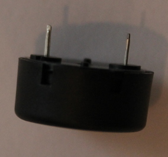

Buttons and Buzzers
===================

Introduction
------------

In the first part of the experiment, you will connect a button to your
Arduino or Shrimp to your Arduino and use it to control the on-board
LED.

### What you will learn

You wll learn how to connect a button to the Arduino and how to read the
state of the button in a sketch.

### How this will help you

Most Arduino projects need input of some kind. A button or buttons are
often useful as inputs.

Wiring up a button
------------------

Buttons are a great way to control things. We all know what to do with a
button, and it's really easy to get an Arduino to detect when a button
has been pushed.

There are two aspects to using a button as an input to an arduino
sketch. You need to wire the button up to the Arduino, and you need to
write some code.

Let's start with the wiring, and the electronic principles behind it.

Most buttons are switches which make a connection when pressed. In
electronic techspeak, they are *Normally Open (NO)*. It's also possible
to get buttons which break a connection when pushed; these are known as
*Normally Closed (NC)*.

For this set of experiments you'll be using a *Normally Open*
pushbutton. It's designed so that you can use it on a breadboard.

What you will do is connect one side of the button to +5 volts and the
other to an Arduino input.

That way, when the button is pushed the Arduino input will be raised to
5 volts, which the Arduino sees as an *On* signal.

What about the input when the button isn't pushed?

With the circuit as I've described it so far, the Arduino output is
*floating* (not connected to anything) until the button is pushed. You
can't predict what voltage the Arduino will see on a floating input. We
need to make sure that the input is *Off* (zero volts) when the button
is not pushed, and *On* (5 volts) when the button is pushed.

How *not* to do it!
-----------------

It's tempting to connect the output side of the button directly to
ground (zero volts), but that's a **really bad idea**.

It will certainly ensure that the Arduino input is at zero volts when
the button isn't pushed. If you pushed the button you would be
connecting the 5 volt supply to 0 volts. That would be a *short
circuit*; at best the USB port would shut down, and at worst you could
damage your laptop.

Use a resistor
--------------

Instead, connect the Arduino input to ground
through a resistor. The recommended value is 10,000 (10K) ohms. That's
low enough to make sure that the Arduino input will be *Off* until the
button is pushed, and high enough that it won't pass much current when
it is pushed.

The Arduino circuit
-------------------

To wire up an Arduino to a button you will need three jumper wires, a
button, the Arduino and the breadboard.

### The Fritzing diagram

Here's how to connect up the hardware if you're using an Arduino.

This diagram was produced by a wonderful piece of free software called
[Fritzing](http://fritzing.org/home/).

As you can see, you need to connect one side of the pushbutton to +5
volts. That's the red wire.

The other side is connected to Arduino digital input 8. That's th yellow
wire. It's also connected to one end of the 10K ohm resistor.

The other end of the resistor is connected to ground (zero volts);
that's the black wire.

### The real breaboard

Here's a photo of the layout in real life. As you can see, Fritzing does
a great job of illustrating what a real layout looks like.

### The schematic diagram

One of the things you can do with Fritzing is create a [circuit
diagram](http://en.wikipedia.org/wiki/Circuit_diagram) - a symbolic
representation of your circuit which others can read if they want to
understand how your circuit works.

Connecting the Shrimp
---------------------

The connections to the Shrimp are very similar.

If you take a look at the [ATMega 328
diagram](http://www.rareschool.com/orphans/images/Atmega168PinMap2.png)
we used earlier, it shows which pins are connected to ground and 5
volts, and where to locate digital input 8.

### Fritzing the Shrimp

Here's a Fritzed diagram showing how to wire up the Shrimp to the
button.

Writing the code
----------------

It's time to write some code. As before, you'll modify an existing
sketch rather than starting form scratch.

There's an example sketch in the Arduino IDE which uses a button to
flash an LED. You'll need to make a minor change to it, as you are using
digital input 8 but the sketch uses pin 2.

To test your button circuit, start by loading the Arduino sketch. Start
the IDE and then load examples/02.digital/button.

In that sketch you'll see a line which reads

const int buttonPin = 2;

Change that to refer to the digital input you're using - digital pin 8.

If you intend to save the sketch, you may want to change the comments so
that they also refer to pin 8. That way, when you review your code after
the course is over, you won't be surprised by a conflict between the
comments and the code.

There's edited version of the sketch
[here](http://www.rareschool.com/orphans/code/button.ino).

### What we haven't done - debouncing

The sample code you've written should work correctly, but some
applications need more complex code when using buttons.

Imagine for a moment that you have written code that should count the
number of times a button is pressed.

Using the simple approach we adopted in this example, you'd see a
surprising result. Sometimes the counter would go up by more than one
for a single button press.

The reason is a phenomenon called *Contact Bounce*.

When you press a push-button, the moving part of the button pushes two
contacts together. Sometimes the contacts hit and bounce. As a result,
the circuit closes more than once. If the bouncing persists for a few
thousands of a second, it's possible that a single button push will
cause the contacts to open and close several times.

Since computers like the Arduino execute the steps in your program in a
few millionths of a second, the Arduino might see the bouncing contacts
as multiple button presses, and would therefore increment the counter
several times.

If you want to see a way round the problem, take a look at the Arduino
example called Debounce. If you want to try it out with the circuit
you've set up you will need to modify the sketch to use digital input
pin 8 - but by now that should be easy :)

An annoying doorbell
--------------------

LEDs are great, but there are times when you need some other way of
communicating.

One useful component is the piezo buzzer. These come in two main forms.
One makes a horrid noise whenever you apply power; the other can make
more interesting sounds.

The course kit contains a buzzer that can make a range of sounds.

In this experiment you'll use the button to signal to the Arduino that
you want to play a simple (but very annoying) tune on the buzzer.

### What you will learn

You'll learn how to connect a piezo buzzer to the Arduino and use the
tone library function to create sounds.

### How this will help you

Sounds play an important part in many popular Arduino projects from
doorbells to toys to robots.

Wiring up the Buzzer
--------------------

You'll add the buzzer to the button configuration that you created in
the main part of exercise 4.

### Piezo buzzer

Here's a picture of the piezo buzzer.

It has two pins. For this experiment, you'll connect one pin to ground
(zero volts) and one pin to a digital output on the Arduino. You can use
digital pin 2.

### The buzzer on a Fritzing diagram

Here's the layout as displayed by Fritzing. The buzzer in Fritzing's
library looks a little different from the buzzer in your kit.

### A breadboard with the real buzzer

Here's the real buzzer on a breadboard.

### Using the Shrimp

If you're using the Shrimp you'll need to find out which pin corresponds
to digital pin 2 on the Arduino.

You can do that from the Arduino pinout diagram you used in earlier
units.

Writing and testing the sketch
------------------------------

Once you've connected the buzzer, you'll need to write a sketch to
control it.

As usual, it's worth while looking for a sketch which does something
similar and adapting it rather than starting form scratch.

There are four promising examples included with the Arduino IDE. You can
find them under Examples/02. Digital. Take a look at the one called
toneMelody.

The comment says this is designed for an 8 ohm speaker connected to pin
8.

You'll be using a buzzer (which works just as well) but I've suggested
that you use pin 2 rather than pin 8. You'll need to find the places in
the sketch which make use of that pin number.

There are several references to the number 8 but many of them are
constant values: durations of notes, counts and so forth.

There are two places where the number 8 refers to the Arduino pin to use
in the calls to the functions tone and noTone.

You can find details of these library functions
[here](http://arduino.cc/en/reference/tone) and
[here](http://arduino.cc/en/Reference/NoTone).

Here are the places you'll need to edit:

        tone(**8**, melody[thisNote],noteDuration);

        // to distinguish the notes, set a minimum time between them.
        // the note's duration + 30% seems to work well:
        int pauseBetweenNotes = noteDuration * 1.30;
        delay(pauseBetweenNotes);
        // stop the tone playing:
        noTone(**8**);

Change each highlit 8 to 2, save the sketch into your sketchbook and
upload it to the Arduino.

### Testing the buzzer

At this point you should be able to check that you have wired up the
buzzer correctly and made appropriate changes.

When the sketch starts it should play a short tune once and once only.
You can press the button but it will have no effect, as the sketch does
not currently read it.

### Improving the sketch

At present the sketch plays the tune using code that is run once in
setup.

You want to run the code each time the button is pressed. The way I did
that involves two steps.

1.  Create a new function \_play \_ and move the code that plays the
    tune from setup to play.
2.  In loop, check if the button has been pressed, and if so play the
    tune.

For the second step, you can adapt the code you wrote in the button
exercise.

You can download my solution
[here](http://www.rareschool.com/orphans/code/doorbell.ino).

### Test the new version

Upload the code to the Arduino or Shrimp and test it. The tune should
play whenever the button is pressed

Challenge exercise
------------------

Once you've got the doorbell working, you could look at converting the
morse code example from experiment 2 to use a buzzer.
