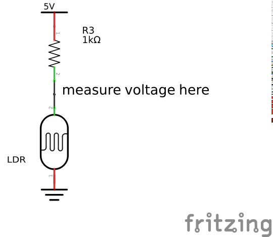
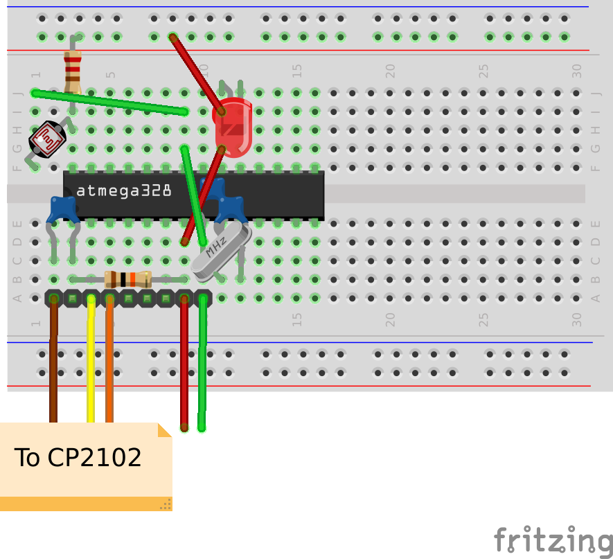
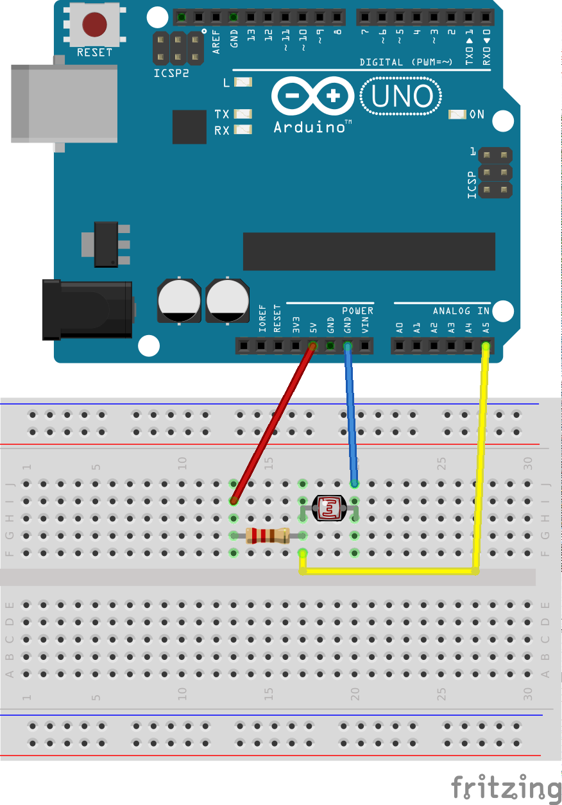

Analogue inputs and the LDR
===========================

Analogue inputs
---------------

### Introduction

These are the final experiments of this course. You'll monitor the light
level with an Arduino and a Light Dependent Resistor (LDR). In the
optional exercise you'll show how bright it is using a bar display.

So far you've seen how to tell the Arduino how to read a digital
(on/off) input. In these experiments you'll use an Arduino analogue
input. These can measure a voltage between 0 and 5 volts. The
Shrimp and the Arduino Uno have six analogue inputs available (labelled
A0 to A5); the Mega2560 has 16.

#### What you will learn

You'll learn about how LDRs behave as the light level changes,
and you will learn how to read the value of an analogue input on the Arduino.

You'll also learn a couple of useful techniques for scaling
values and generating a bar display from a numeric value.

#### Why this is useful

If you're building a robot that steers itself, an unmanned helicopter, a
weather station or an energy monitor, you'll need to read analogue
values.

Bar displays are a great way of showing the value of an output. For
instance, you might use one in a thermometer-type display for a weather
station, or a speed display for a robot.

### Light dependent resistors

LDRs (sometimes called photoresistors) are inexpensive, easy-to-use
components that measure light levels by changing their resistance. A
typical LDR might have a resistance of 5,000 ohms in daylight and
100,000 ohms in the dark.

#### An LDR

[The image on this wikipedia
page](http://en.wikipedia.org/wiki/Photoresistor) shows a typical LDR.

#### Schematic diagram

Here's how you can convert a varying light level into a varying voltage
that the Arduino can measure.

The LDR is connected in series with a normal fixed resistor. As the
light level changes, the resistance of the LDR changes too.

If you apply 5 volts across the circuit, the voltage at the junction of
the LDR and the fixed resistor will change as the voltage of the LDR.

The circuit is a voltage divider; the voltage across each resistor is
proportional to the resistance. So when the LDR is *brightly lit*, its
resistance will be low and *the voltage across it will be low*.

When the LDR is *dark*, its resistance will be high and *the voltage
across it will be high*.

#### Understanding Analogue input values on the Arduino

When you use and Arduino to measure a voltage, you don't get a value in
volts. The value returned by analogRead is an integer that ranges
between 0 and 1023. A value of 0 indicates an input of 0 volts; a value
of 1023 indicates an input of 5 volts.

You'll need to take account of that later on when coding your sketch.

### Breadboarding the LDR

You should start by breadboarding the circuit using the LDR and resistor
from your experimenter's kit.

#### Using the Shrimp

Here's how to add the LDR and resistor if you're using the Shrimp.

#### Using the Arduino

This is the corresponding diagram for the Arduino

### Adapting the Analogue example

There's a useful sketch among the Arduino samples which you can use to
test your circuit as soon as you've breadboarded it.

It's called *AnalogInput*, and it was intended to be used with a
potentiometer (a variable resistor) but it will work just as well with
our LDR and resistor combination.

You'll need to make one change to it: the sketch assumes that you're
using analogue input 0 (A0) but if you've followed the diagrams earlier
you will be using analog input 5 (A5). It should be easy to see the the
place in the sketch to make that change.

You may also want to update the comments if you want to keep a copy of
the modified sketch for future use.

#### Testing the sketch

Once you've uploaded the modified sketch, you can test it.

Make sure your LDR is in a bright light and then shade it with your
hand. The LED on pin 13 should change the rate it flashes as the LED
gets darker or lighter. If so, you've got a working circuit.
