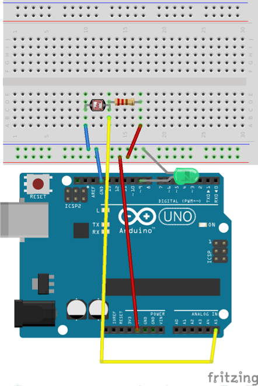
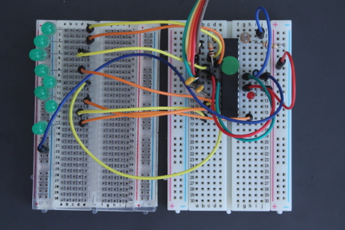

Calibrating the LDR
===================

### Introduction

In the previous section you saw how to build a circuit to measure
light levels.

#### What you will learn

You'll learn how to calibrate the LDR.

#### Why this is useful

You'll be using the Serial library and the Serial terminal for testing;
that's a common practice when developing Arduino projects.

### Breadboarding

You'll need to connect eight of the 5v LEDs to the Arduino or Shrimp,
and you'll need to use the LDR and resistor that featured in the earlier
experiment.

#### Breadboarding with the Arduino

#### Breadboarding with the Shrimp

### Calibrating the LDR

Once you've got the circuit set up you'll need to write and upload the
sketch.

The first challenge is to find out the range of voltages seen by the
Arduino as the light level goes up or down.

This will depend on several factors:

1.  How light or dark your environment is
2.  What LDR and resistor value you're using

Even if you are using a known type of LDR each indivual specimen will
have slightly different characteristics, so you will need to find out
the range of voltage by experiment.

#### Start with the AnalogInOutSerial sketch

As usual, a little research will turn up an existing sketch you can use
as a starting point.

You'll find the AnalogInOutSerial sketch among the analogue examples in
the Arduino IDE.

It's intended to create an analogue output based on an analogue input,
which we don't need, but it also displays the input and output values on
the serial interface.

What you can do is remove the part of the code that is driven by the
analogue output and use the serial terminal to show the input value as
seen by the Arduino.

#### Edit the sketch and upload it

Here's the code for the sketch, without comments. The statements you
**won't** need are shown in bold.

    const int analogInPin = A0;
    const int analogOutPin = 9;

    int sensorValue = 0;        
    int outputValue = 0;        

    void setup() {
      Serial.begin(9600); 
    }

    void loop() {
      sensorValue = analogRead(analogInPin);            
      outputValue = map(sensorValue, 0, 1023, 0, 255);  
      analogWrite(analogOutPin, outputValue);          

      Serial.print("sensor = " );                       
      Serial.print(sensorValue);      
      Serial.print("\t output = ");      
      Serial.println(outputValue);   

      delay(2);                     
    }

Delete them. You'll need to make two other changes.

The sketch uses analogue input A0 but the diagram show the wiring for
A5, because that is easier to wire up if you are using a Shrimp.

In the line below, you need to **change A0 to A5**.

    const int analogInPin = A0;

The sketch also waits 2 milliseconds (ms) between samples. Results would
race by when you ran the sketch. Instead, you might read and display
samples every 100 milliseconds. That's 1/10 sec, which should be fine.

Change the line below: **replace 2 by 100** to get a 100 ms delay.

    delay(2);

Once you've made those changes **upload the code**.

#### Checking the input range

To check the range of voltage at the analogue input, open a Serial
Terminal wand watch the results as you cover and reveal the LDR on the
circuit board. You should see the input value varying; for the
components I used, the light value of the input was around 170 and the
dark value was around 600.
