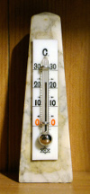
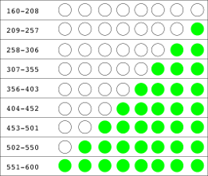

Coding the LED BAR display
==========================

This is the final part of experiment 5.

### Introduction

In this experiment you will complete the coding for the LED display.

#### What you will learn

You'll learn how to use an array of LEDs to display an analogue value.

#### Why this is useful

Analogue displays are easy to read, and you can see them at a distance.

Here's a classic example:

#### Mercury thermometer

By Anonimski (Own work) CC-BY-SA-3.0, via Wikimedia Commons

### Extending the sketch

If you finished the previous part of this experiment you will have an
idea of the range of values seen by the Arduino as the amount of light
falling on the LDR varies.

Make a note of the dark and light levels displayed in the Serial
terminal window. I got a reading of 160 in full light, which went up to
just under 600 when I covered the LDR.

#### What you're aiming for

You're going to use the array of LEDs to indicate the amount of light on
the LDR, with no LEDs on on the dark and all eight LEDs on in the
brightest light.

Trick question: how many different light levels does this communicate?

Used in this way, eight LEDs can display nine distinct light levels,
ranging from 0 to 8.

#### Scaling the output - 1

This means that you can't directly use the value returned by the
analogueRead command.

The value returned by analogRead always lies between 0 and 1023, so it's
tempting to divide it by 113 to get a number between 0 and 9.

There are two problems with that approach. The first is that our range
of input values will be more limited: 160-600 in my case.

The second is that as the input value goes **down** (indicating more
light falling on the LDR) we want the number of LEDs to go **up**.

The diagram below shows how the sketch should translate from an input
level to an LED output.

#### LDR inout and LED output

#### Scaling the output - 2

You could calculate the output (0-8) from the input (600-180), but
there's a much simpler way.

The serial sketch you modified earlier has a line that reads

          outputValue = map(sensorValue, 0, 1023, 0, 255);

This uses a library function which you can use to rescale the input to
cover the range of output values you want.

If you change the line to

          outputValue = map(sensorValue, 160, 600, 8, 0);

upload the changed sketch, and look in the terminal window, you should
see the output ranging from 8 down to 0 as the LDR is covered.

#### Turning on the LEDs

All that remains is to turn on the right number of LEDs as the light
value changes.

You can borrow some code from the earlier LED array code to do this.

Add the following lines to the start of your sketch:

          #define BIT_COUNT 8
          int led_pins[BIT_COUNT] = {2, 3, 4, 5, 6, 7, 8, 9};

and extend your setup function by adding

          for (int i = 0; i < BIT_COUNT; i++) {
                     pinMode(led_pins[i], OUTPUT);
          }

Finally, you can turn each LED off or on depending on the value output
from the map function. I used code like this at the end of my loop:

      for (int i = 0; i  8; i++) {
        if (outputValue > i) {
          digitalWrite(led_pins[i], HIGH);
        } else {
          digitalWrite(led_pins[i], LOW);
        }
      }

Upload your sketch. The result should look [like
this](http://youtu.be/SjATZ9scOUM)

### A DIY weather station

This experiment is the basis of a simple weather station.

You could mount the LDR by a window, or replace it by a temperature
sensor, and use the LEDs to show you how bright or warm it was outside.

Early next year I hope to publish details of a more ambitious version on
[RAREblog](http://blog.rareschool.com/) but if you can't wait until
then, drop me a note and I will tell you more about what I have in mind.
