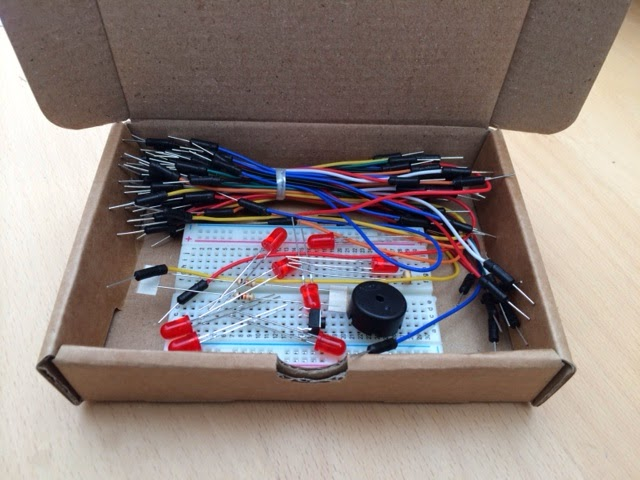
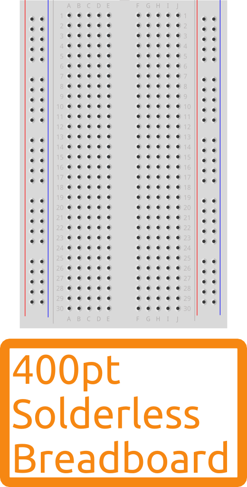

# Appendix A (Hardware)

You will need:

-   400 point breadboard
-   75 jump wires
-   8 5mm 5V LEDs
-   5V Piezo buzzer
-   PCB-mounting pushbutton (Normally Open).
-   LDR (about 5K ohms in daylight)
-   resistors: 2 10K Ohm

You can [buy a complete kit from SK
Pang.](http://skpang.co.uk/catalog/arduino-life-after-blink-kit-p-1341.html)

If you prefer to source the components you need, here are the relevant details.

T> When comparing prices, remember to include any postage and packaging charge.
It's often cheaper to buy everything from a single supplier.

## 400 point breadboard

These are available from many suppliers at widely varying prices.

You'll find it easiest to work with a breadboard that identifies connection points by number/letter.

You'll also want to make sure the breadboard is reliable. There is nothing more frustrating than looking for hours
for a mistake in your wiring when the problem is actually a defective breadboard.

One UK breadboard supplier I can recommend is [Shrimping It!](http://shrimping.it/blog/kits/) where you can also get
the parts you need for [Making the Shrimp](https://leanpub.com/makingtheshrimp)

Another is [Oomlout](http://oomlout.co.uk/). They also sell the next few items,

##   75 jump wires

##   8 \* 5mm 5V LEDs

##   5V Piezo transducer

##   PCB-mounting pushbutton (Normally Open, or NO).

##   LDR (about 5K ohms in daylight)

##   resistors: 2 \* 10K Ohm

